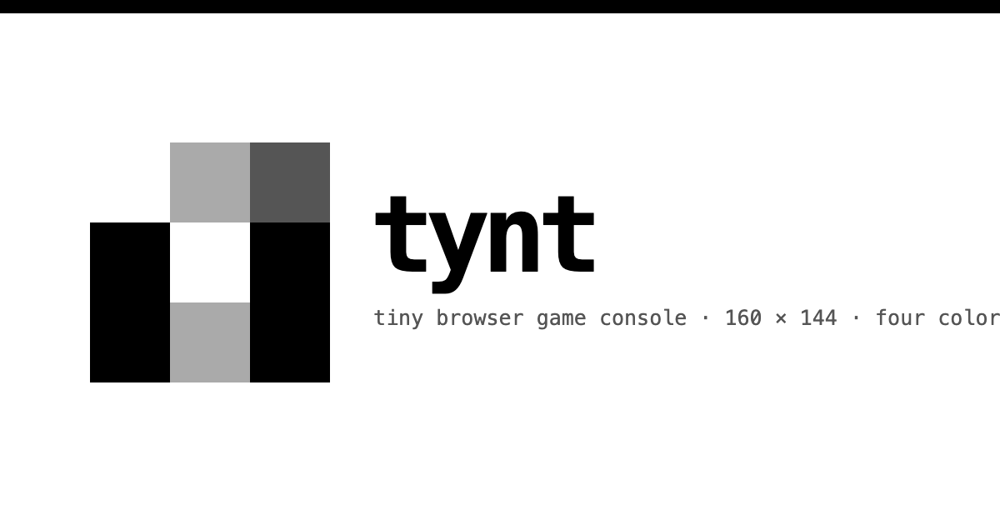

# tynt

[](https://github.com/cristianbgp/tynt/actions/workflows/check.yml)
[](LICENSE)

<p align="center">
  
</p>

tynt is a tiny browser game console. Write a cartridge in TypeScript, press Run, and draw on a fixed 160 × 144 canvas with four shades of gray.

The project is local-first and static: no server, accounts, publishing service, or cloud storage. Public cartridges are curated through GitHub pull requests, while your personal library stays in IndexedDB on the current browser and device.

## Repository map

This repository keeps the product and engine separate without using Bun workspaces:

- `apps/web`: the React, Vite, Tailwind CSS, and shadcn/ui application.
- `apps/docs`: the custom Next.js and MDX documentation site at [docs.tynt.dev](https://docs.tynt.dev).
- `packages/core`: the browser-independent TypeScript engine and cartridge format.
- `cartridges`: every bundled and community-submitted game, using one shared publication format.
- `scripts/cartridges`: validation and catalog generation for public cartridges.

Each package owns its own `package.json`, `bun.lock`, and `node_modules`. The root package has no application dependencies; it only coordinates commands.

## Start locally

Install [Bun](https://bun.sh), then run:

```sh
bun run install:all
bun run dev
```

The root development command opens `mprocs` with the web app and documentation server. You can also run either process directly:

```bash
bun run dev:web
bun run dev:docs
```

The app opens at `http://127.0.0.1:4173`.

Routes:

- `/`: a compact introduction with a randomly featured playable cartridge and recent games.
- `/editor`: cartridge editor and game preview.
- `/gallery`: searchable bundled and community-submitted games.
- `/cartridges/:slug`: cartridge details, README, source, and play/remix actions.
- `/library`: searchable cartridges saved on this device.
- `/play/public/:slug`: focused play mode for a public cartridge.
- `/play/local/:id`: focused play mode for a cartridge saved on this device.
- `/sprites`: an 8×8 four-color sprite editor with cartridge-ready output.
- `/sounds`: a sixteen-step sound-effect editor with cartridge-ready output.

Root commands:

```sh
bun run test       # core and web unit tests
bun run test:e2e   # Playwright browser tests
bun run cartridges:check # validate every public cartridge
bun run dev:docs   # serve docs on http://127.0.0.1:4174 and regenerate on changes
bun run docs:build # generate the API reference and build the documentation site
bun run build      # type-check and build every package
bun run check      # all tests and builds
```

You can also work inside either package independently:

```sh
cd packages/core
bun install
bun test

cd ../../apps/web
bun install
bun run dev

cd ../docs
bun install
bun run build
```

The docs are organized for cartridge creators: overview, getting started, examples, cartridge files, publishing, security, and the cartridge API. Cartridge API metadata lives in `packages/core/src/cartridge-api.ts`; the editor autocomplete and generated API page both consume that catalog. Guides live as MDX in `apps/docs/content/docs`, while the API generator writes `apps/docs/content/docs/reference/cartridge-api.mdx`. The app also exposes searchable docs, raw Markdown routes, `llms.txt`, and `llms-full.txt`.

## Controls

The emulator buttons and keyboard feed the same input state:

- Arrow keys or the D-pad move the square.
- Z or A changes the square's shade.
- X or B resets its position and shade.

Run or rerun focuses the preview automatically so gameplay keys are ready immediately. Toolbar actions also have global shortcuts:

- Control + Shift + Enter: Run or rerun on every platform.
- Command/Control + O: Import a `.tynt` cartridge.
- Command/Control + S: Export the current cartridge.

On phones, the editor uses **Code** and **Play** panes instead of placing both full workspaces in one long page. A successful run selects Play and focuses the console; switching back preserves the editor and running game state.

Use **New** in the editor toolbar to start from Blank, Arcade, Platformer, Puzzle, or Top-down scaffolding. Choosing a template replaces the current editor draft, so save or export work that should remain as a separate copy.

## Cartridge basics

A cartridge exports three functions. tynt calls `init` once, then calls `update` followed by `draw` at a fixed 60 Hz.

```ts
let x = 76;
let y = 61;
let shade = 3;

export function init(): void {
  clear(0);
}

export function update(): void {
  if (button("left")) x = Math.max(0, x - 1);
  if (button("right")) x = Math.min(152, x + 1);
  if (button("up")) y = Math.max(0, y - 1);
  if (button("down")) y = Math.min(136, y + 1);
  if (buttonPressed("a")) shade = shade === 3 ? 1 : shade + 1;
  if (buttonPressed("b")) {
    x = 76;
    y = 61;
    shade = 3;
  }
}

export function draw(): void {
  clear(0);
  rect(x, y, 8, 8, shade, true);
  text("tynt", 72, 77, 2);
}
```

The runtime provides:

```ts
clear(color?: number): void
pixel(x: number, y: number, color: number): void
line(x0: number, y0: number, x1: number, y1: number, color: number): void
rect(x: number, y: number, width: number, height: number, color: number, fill?: boolean): void
circle(x: number, y: number, radius: number, color: number, fill?: boolean): void
triangle(x1: number, y1: number, x2: number, y2: number, x3: number, y3: number, color: number, fill?: boolean): void
text(value: string, x: number, y: number, color: number): void
sprite(pixels: number[], width: number, height: number, x: number, y: number, transparent?: number): void
map(tiles: number[], columns: number, tileWidth: number, tileHeight: number, spritesheet: number[], sheetColumns: number, x?: number, y?: number, transparent?: number): void
camera(x?: number, y?: number): void
button(input: "left" | "right" | "up" | "down" | "a" | "b"): boolean
buttonPressed(input: "left" | "right" | "up" | "down" | "a" | "b"): boolean
buttonReleased(input: "left" | "right" | "up" | "down" | "a" | "b"): boolean
seed(value?: number): void
random(min?: number, max?: number): number
overlap(ax: number, ay: number, aw: number, ah: number, bx: number, by: number, bw: number, bh: number): boolean
pointInRect(px: number, py: number, x: number, y: number, width: number, height: number): boolean
clamp(value: number, min: number, max: number): number
wrap(value: number, min: number, max: number): number
frame(): number
every(interval: number, offset?: number): boolean
after(frames: number): boolean
tone(frequency: number, duration?: number, volume?: number, wave?: "square" | "sine" | "triangle" | "sawtooth"): void
sfx(notes: number[], step?: number, volume?: number, wave?: "square" | "sine" | "triangle" | "sawtooth"): void
```

Use `0` inside an `sfx()` note array for a silent step. The sound editor generates named notes from C3 through C6 and exports their frequencies in this format.

Coordinates are rounded to integers and clipped to the canvas. Color indexes are clamped from 0 to 3. The framebuffer persists between frames unless `clear` is called. The 3×5 `text()` font supports printable ASCII; lowercase letters use the matching uppercase glyph, and unsupported Unicode renders as `?`.

`clamp()` uses an inclusive range. `wrap()` uses a half-open range where `min` is included and `max` wraps back to `min`. Invalid or non-finite ranges stop the cartridge with a visible API error.

## Public cartridges

The editor dropdown and gallery are generated from the top-level `cartridges/` collection:

- `starter.tynt`: movement, actions, reset, and scoring.
- `shapes.tynt`: every drawing primitive.
- `animation.tynt`: fixed-step movement.
- `snake.tynt`: grid movement, growth, collision, and scoring.
- `asteroids.tynt`: a seeded asteroid field with momentum, projectiles, audio, and win/lose states.
- `platformer.tynt`: gravity, jumping, collision helpers, collectibles, and a finish state.
- `flappy.tynt`: one-button movement, seeded pipe gaps, collision helpers, and scoring.
- `coin-dash.tynt`: a timed scrolling game using sprites, maps, camera, seeded randomness, collisions, timers, and synthesized audio.
- `reaction.tynt`: deterministic random delays, frame timing, early presses, and reaction results.
- `tiny-quest.tynt`: a scrolling maze with world collisions, collectibles, a goal zone, and synthesized audio.
- `sprites.tynt`: the 8×8 tynt mark, transparent pixel sprites, and two-frame animation.
- `soundboard.tynt`: individual tones and short synthesized effects.
- `pong.tynt`: paddle collision, opponent movement, serving, and scoring.
- `sokoban.tynt`: a compact tile-map pushing puzzle.
- `lunar.tynt`: gravity, limited fuel, procedural terrain, and safe landing.

Every gallery game has a canonical `/cartridges/<slug>` page with its cover, publication date, metadata, controls, rendered README, source, Play action, and Remix action. Newer publication dates appear first by default; the gallery can also sort by title or author, use card tags as filters, and open a random game from the visible results. Remix opens an editable local copy in the editor. Every game shown in the gallery, including tynt's bundled examples, is a normal repository submission under `cartridges/<slug>/` containing `game.tynt`, `cartridge.json`, `cover.png`, and an optional README. The catalog discovers these directories automatically; adding a game does not require editing an application registry or central list. The Bun generator validates and compiles them before they can enter a production build.

To submit a game, copy `cartridges/_template`, export your cartridge from the editor, add a 320 × 288 nearest-neighbor cover captured from the 160 × 144 game canvas, run `bun run check`, and open a pull request. See [CONTRIBUTING.md](CONTRIBUTING.md) for the complete format and license requirements. Merging the pull request publishes the cartridge; no account or upload server is required.

All public cartridges use the MIT License. Contributors must own their submitted source and artwork or have permission to distribute them under MIT.

## Local library and play mode

Use **Details** in the editor to set a cartridge title, author, description, and controls. Format version 1 is fixed by tynt. **Save** creates or updates a local library entry and captures the current canvas as its preview thumbnail. **Play** saves first and opens the cartridge in focused play mode.

The library is ordered by most recently updated and searches titles, authors, descriptions, and controls. Each cartridge can be opened in the editor, played, edited, duplicated, or deleted. This data is stored only in the current browser's IndexedDB; deleting browser storage removes it.

Play mode starts automatically and focuses the console. It provides pause/resume, restart, mute, fullscreen, editor, and library controls. Pausing preserves the visible frame; resuming and restarting begin again from the cartridge's `init` function.

The editor preview also includes a compact debugger. Open it to pause or resume execution, inspect the current frame and held or newly pressed inputs, advance exactly one update while paused, restart the cartridge, or download the current canvas as a nearest-neighbor 320 × 288 PNG.

## Cartridge files and isolation

Import and Export use readable UTF-8 `.tynt` files. Version 1 requires a non-empty title, author, description, controls, and TypeScript source, plus exact fixed canvas and palette metadata. Unknown fields are rejected; future format changes require a new version. Local drafts may remain incomplete until export. Generated PNG thumbnails and local timestamps stay in the browser library rather than exported files. The editor also keeps a versioned local autosave for crash recovery.

Cartridges are untrusted. Every successful run gets a fresh opaque-origin sandboxed iframe, which owns a disposable Web Worker. A restrictive content security policy and message validation prevent cartridge code from reaching the host page or external services. Drawing and audio output have fixed budgets; exceeding one ends the run.

Stop, rerun, runtime failure, protocol failure, or timeout destroys the iframe and worker. An infinite loop may briefly consume one worker thread, but it cannot freeze the editor.

Public covers are decoded with CRC validation and re-encoded during catalog generation, so submitted metadata and unknown PNG chunks are not published. Pull-request checks use read-only repository permissions and do not deploy. Maintainers should still review every diff before running a contributor branch locally. See [SECURITY.md](SECURITY.md) for the threat model, safe review checklist, residual risks, and private reporting guidance.

## License

tynt, including its engine, web app, documentation, bundled examples, and submitted cartridges, is available under the [MIT License](LICENSE).
